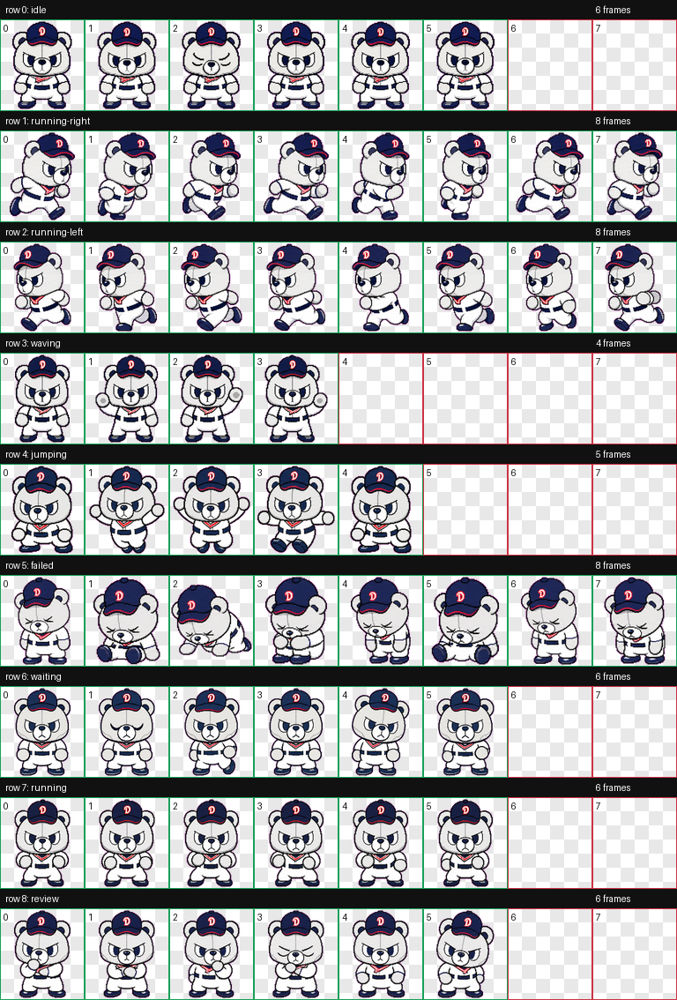

# KBO Mascot Codex Pet

Codex에서 사용할 수 있는 커스텀 KBO 마스코트 스타일 펫 모음입니다.

## 철웅이

철웅이는 네이비 야구 모자를 쓴 씩씩한 하얀 곰 디지털 펫입니다.



### 설치

이 저장소를 내려받은 뒤, `pets/cheolwoongi` 폴더를 로컬 Codex 펫 폴더로 복사하세요.

```bash
mkdir -p ~/.codex/pets
cp -R pets/cheolwoongi ~/.codex/pets/
```

설치 후 Codex를 다시 열면 `철웅이` 펫을 사용할 수 있습니다.

### 포함 파일

- `pets/cheolwoongi/pet.json`
- `pets/cheolwoongi/spritesheet.webp`
- `previews/cheolwoongi/contact-sheet.png`
- `previews/cheolwoongi/idle.mp4`

## Notes

This is a fan-made Codex pet asset. It is not affiliated with or endorsed by KBO, Doosan Bears, or any related trademark owner.
