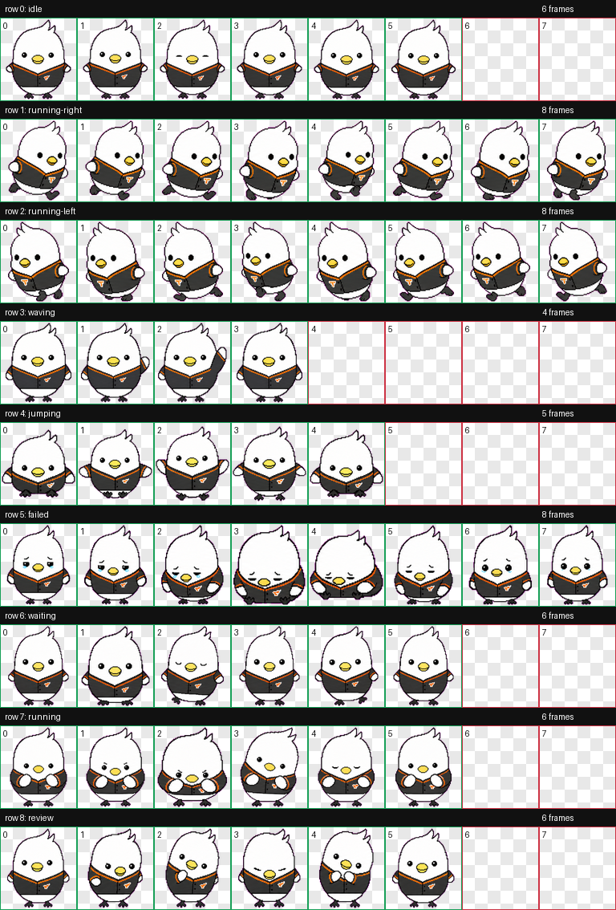
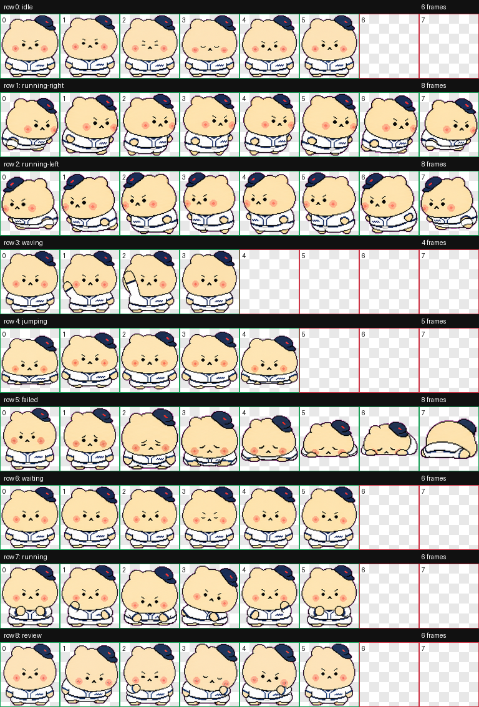
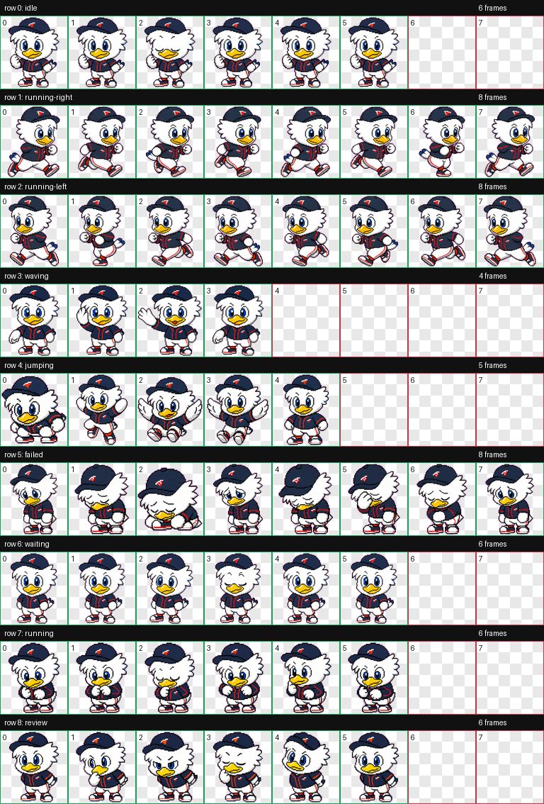
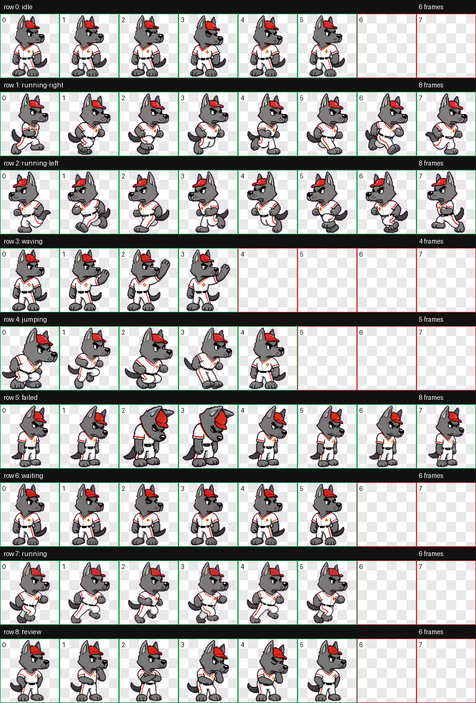
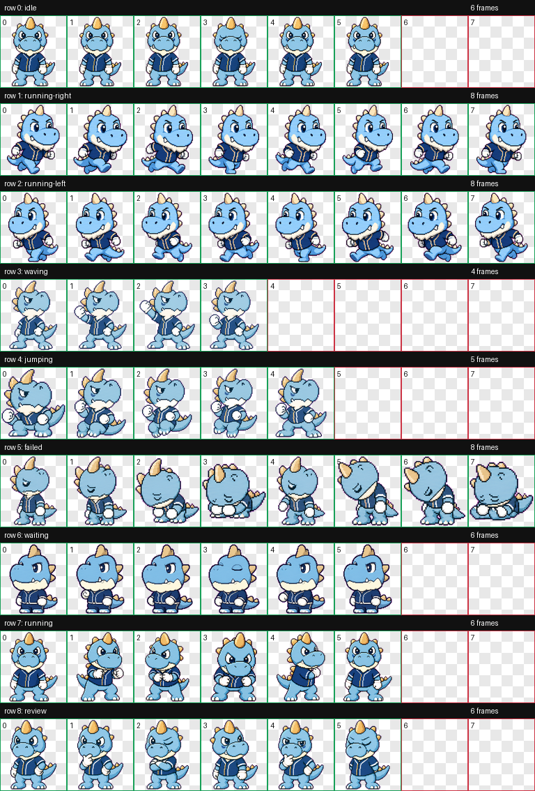
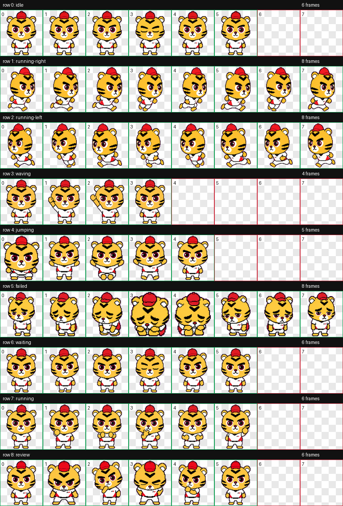

# KBO Mascot Codex Pets

Codex에서 사용할 수 있는 KBO 마스코트 스타일 커스텀 펫 컬렉션입니다.

이 프로젝트의 목표는 KBO 리그 각 팀의 마스코트를 Codex 펫으로 하나씩 제작해 모으는 것입니다.

## Mascots

| Team | Mascot | Pet ID | Status |
| --- | --- | --- | --- |
| 한화 이글스 | 수리 | `soori` | Available |
| 두산 베어스 | 철웅이 | `bears_cheolwoongi` | Available |
| 두산 베어스 | 망그러진곰 | `mang_bear` | Available |
| 롯데 자이언츠 | 누리 | `noori` | Available |
| SSG 랜더스 | 랜디 | `landy` | Available |
| NC 다이노스 | 단디 | `dandi` | Available |
| KT 위즈 | Vic | `vic` | Available |
| KT 위즈 | 또리 | `wiz_ddory` | Available |
| KIA 타이거즈 | 호걸이 | `hogeori` | Available |

다른 팀 마스코트는 순차적으로 추가할 예정입니다.

## Installation

이 저장소를 내려받은 뒤, 원하는 펫 폴더를 로컬 Codex 펫 폴더로 복사하세요.

```bash
mkdir -p ~/.codex/pets
cp -R pets/soori ~/.codex/pets/
cp -R pets/bears_cheolwoongi ~/.codex/pets/
cp -R pets/mang_bear ~/.codex/pets/
cp -R pets/noori ~/.codex/pets/
cp -R pets/landy ~/.codex/pets/
cp -R pets/dandi ~/.codex/pets/
cp -R pets/vic ~/.codex/pets/
cp -R pets/wiz_ddory ~/.codex/pets/
cp -R pets/hogeori ~/.codex/pets/
```

하나만 설치하려면 해당 `cp -R` 줄만 실행하면 됩니다. 설치 후 Codex를 다시 열면 추가한 펫을 사용할 수 있습니다.

## 한화 이글스

### 수리



### 수리 포함 파일

- `pets/soori/pet.json`
- `pets/soori/spritesheet.webp`
- `previews/soori/contact-sheet.png`
- `previews/soori/idle.mp4`

## 두산 베어스

### 철웅이


### 철웅이 포함 파일

- `pets/bears_cheolwoongi/pet.json`
- `pets/bears_cheolwoongi/spritesheet.webp`
- `previews/bears_cheolwoongi/contact-sheet.png`
- `previews/bears_cheolwoongi/idle.mp4`

### 망그러진곰



### 망그러진곰 포함 파일

- `pets/mang_bear/pet.json`
- `pets/mang_bear/spritesheet.webp`
- `previews/mang_bear/contact-sheet.png`
- `previews/mang_bear/idle.mp4`

## 롯데 자이언츠

### 누리



### 누리 포함 파일

- `pets/noori/pet.json`
- `pets/noori/spritesheet.webp`
- `previews/noori/contact-sheet.png`
- `previews/noori/idle.mp4`

## SSG 랜더스

### 랜디



### 랜디 포함 파일

- `pets/landy/pet.json`
- `pets/landy/spritesheet.webp`
- `previews/landy/contact-sheet.png`
- `previews/landy/idle.mp4`

## NC 다이노스

### 단디



### 단디 포함 파일

- `pets/dandi/pet.json`
- `pets/dandi/spritesheet.webp`
- `previews/dandi/contact-sheet.png`
- `previews/dandi/idle.mp4`

## KT 위즈

### Vic


### Vic 포함 파일

- `pets/vic/pet.json`
- `pets/vic/spritesheet.webp`
- `previews/vic/contact-sheet.png`
- `previews/vic/idle.mp4`

### 또리

또리는 KT 위즈 스타일의 검정 마법사 모자와 빨간 포인트를 가진 밝고 장난스러운 하얀 마스코트 디지털 펫입니다.


### 또리 포함 파일

- `pets/wiz_ddory/pet.json`
- `pets/wiz_ddory/spritesheet.webp`
- `previews/wiz_ddory/contact-sheet.png`
- `previews/wiz_ddory/idle.mp4`

## KIA 타이거즈

### 호걸이



### 호걸이 포함 파일

- `pets/hogeori/pet.json`
- `pets/hogeori/spritesheet.webp`
- `previews/hogeori/contact-sheet.png`
- `previews/hogeori/idle.mp4`

## Notes

This is a fan-made Codex pet collection. It is not affiliated with or endorsed by KBO, Hanwha Eagles, Doosan Bears, Lotte Giants, SSG Landers, NC Dinos, KT Wiz, KIA Tigers, or any related trademark owner.
