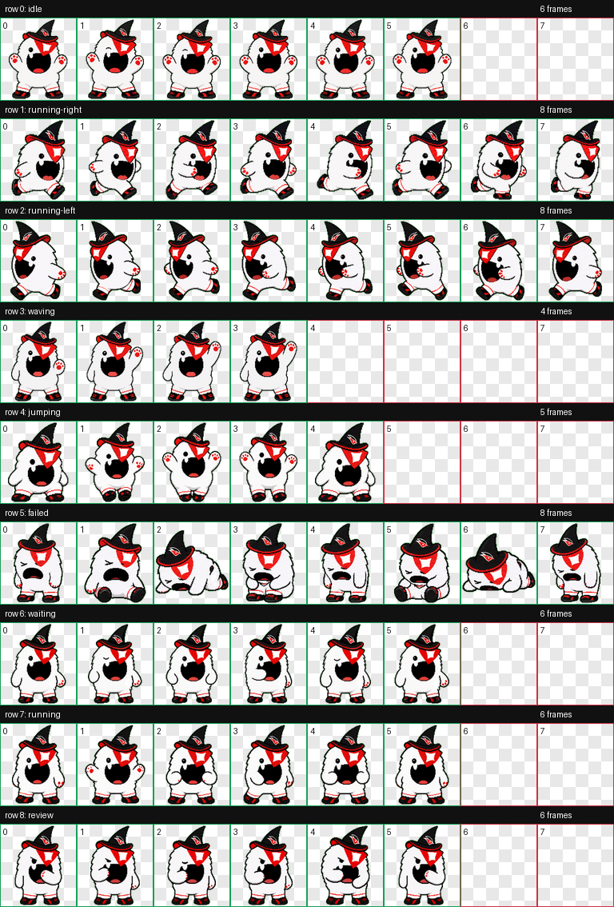

# KBO Mascot Codex Pets

Codex에서 사용할 수 있는 KBO 마스코트 스타일 커스텀 펫 컬렉션입니다.

이 프로젝트의 목표는 KBO 리그 각 팀의 마스코트를 Codex 펫으로 하나씩 제작해 모으는 것입니다. 현재 두산 베어스의 `철웅이`와 KT 위즈의 `또리`가 포함되어 있습니다.

## Mascots

| Team | Mascot | Pet ID | Status |
| --- | --- | --- | --- |
| 두산 베어스 | 철웅이 | `bears_cheolwoongi` | Available |
| KT 위즈 | 또리 | `wiz_ddory` | Available |

다른 팀 마스코트는 순차적으로 추가할 예정입니다.

## 두산베어스
### 철웅이


### 철웅이 설치

이 저장소를 내려받은 뒤, `pets/bears_cheolwoongi` 폴더를 로컬 Codex 펫 폴더로 복사하세요.

```bash
mkdir -p ~/.codex/pets
cp -R pets/bears_cheolwoongi ~/.codex/pets/
```

설치 후 Codex를 다시 열면 `철웅이` 펫을 사용할 수 있습니다.

### 철웅이 포함 파일

- `pets/bears_cheolwoongi/pet.json`
- `pets/bears_cheolwoongi/spritesheet.webp`
- `previews/bears_cheolwoongi/contact-sheet.png`
- `previews/bears_cheolwoongi/idle.mp4`

## KT 위즈
### 또리
또리는 KT 위즈 스타일의 검정 마법사 모자와 빨간 포인트를 가진 밝고 장난스러운 하얀 마스코트 디지털 펫입니다.



### 또리 설치

이 저장소를 내려받은 뒤, `pets/wiz_ddory` 폴더를 로컬 Codex 펫 폴더로 복사하세요.

```bash
mkdir -p ~/.codex/pets
cp -R pets/wiz_ddory ~/.codex/pets/
```

설치 후 Codex를 다시 열면 `또리` 펫을 사용할 수 있습니다.

### 또리 포함 파일

- `pets/wiz_ddory/pet.json`
- `pets/wiz_ddory/spritesheet.webp`
- `previews/wiz_ddory/contact-sheet.png`
- `previews/wiz_ddory/idle.mp4`

## Notes

This is a fan-made Codex pet collection. It is not affiliated with or endorsed by KBO, Doosan Bears, KT Wiz, or any related trademark owner.
