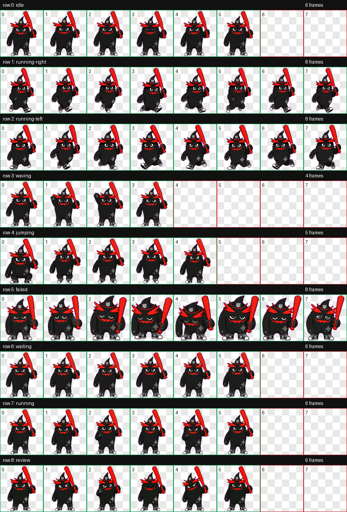

# KBO Mascot Codex Pets

Codex에서 사용할 수 있는 KBO 마스코트 스타일 커스텀 펫 컬렉션입니다.

이 프로젝트의 목표는 KBO 리그 각 팀의 마스코트를 Codex 펫으로 하나씩 제작해 모으는 것입니다.

## Mascots

| Team | Mascot | Pet ID | Status |
| --- | --- | --- | --- |
| 두산 베어스 | 철웅이 | `bears_cheolwoongi` | Available |
| kt wiz | Vic | `vic` | Available |

다른 팀 마스코트는 순차적으로 추가할 예정입니다.

## Installation

이 저장소를 내려받은 뒤, 원하는 펫 폴더를 로컬 Codex 펫 폴더로 복사하세요.

```bash
mkdir -p ~/.codex/pets
cp -R pets/bears_cheolwoongi ~/.codex/pets/
cp -R pets/vic ~/.codex/pets/
```

하나만 설치하려면 해당 `cp -R` 줄만 실행하면 됩니다. 설치 후 Codex를 다시 열면 추가한 펫을 사용할 수 있습니다.

## 두산 베어스

### 철웅이


### 철웅이 포함 파일

- `pets/bears_cheolwoongi/pet.json`
- `pets/bears_cheolwoongi/spritesheet.webp`
- `previews/bears_cheolwoongi/contact-sheet.png`
- `previews/bears_cheolwoongi/idle.mp4`

## kt wiz

### Vic



### Vic 포함 파일

- `pets/vic/pet.json`
- `pets/vic/spritesheet.webp`
- `previews/vic/contact-sheet.png`
- `previews/vic/idle.mp4`

## Notes

This is a fan-made Codex pet collection. It is not affiliated with or endorsed by KBO, Doosan Bears, kt wiz, or any related trademark owner.
